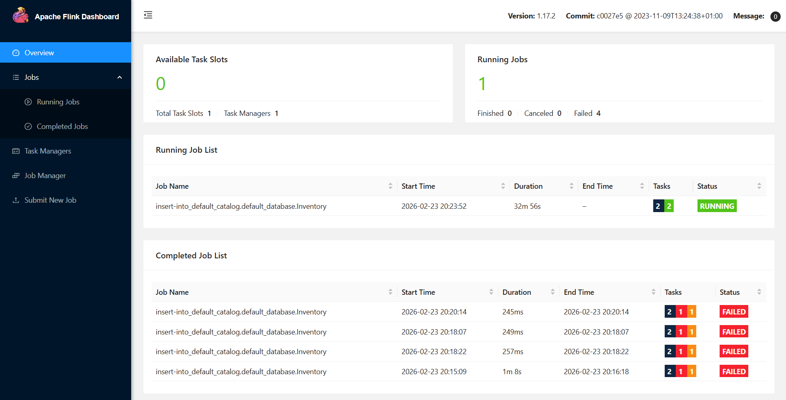
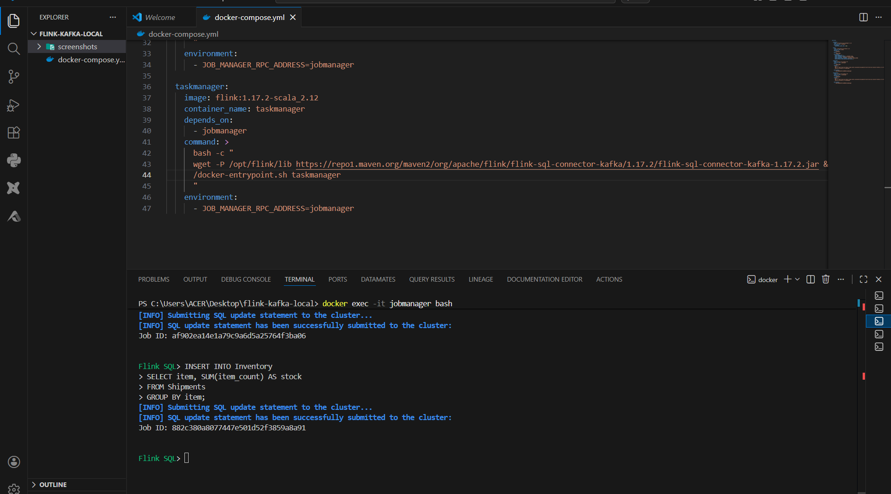
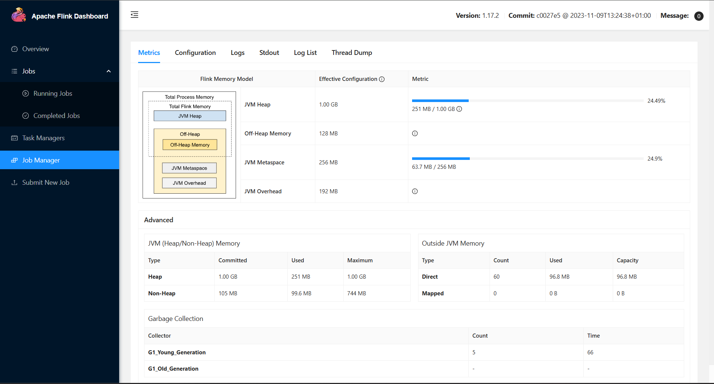
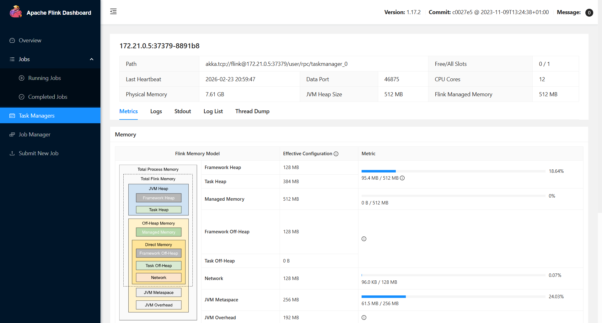
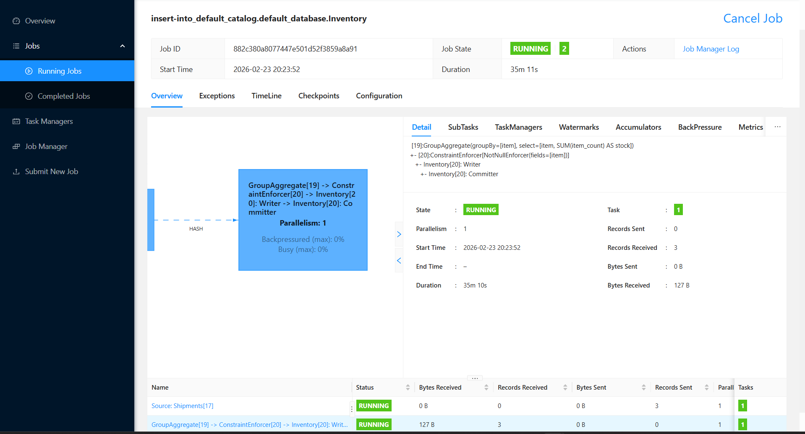

# 🚀 Real-Time Stateful Stream Processing  

Apache Flink + Kafka + Docker Compose + Flink SQL

<p align="center">

  

  

  

</p>

## 📌 Project Overview

This repository shows a **minimal but production-like** real-time streaming pipeline that:

- Ingests JSON shipment events via **Apache Kafka**

- Performs **stateful aggregation** (running sum per item) using **Flink SQL**

- Writes **upsert-style** inventory results back to Kafka

- Runs everything locally using **Docker Compose**

Goal: demonstrate the combination of **event streaming + stateful processing + upsert semantics** in the simplest possible way.

## 🏗 Architecture

```

               ┌───────────────┐

               │  Producer     │

               └───────┬───────┘

                       │  JSON events

                       ▼

             ┌───────────────────┐

             │   Kafka           │

             │   (shipments)     │

             └─────────┬─────────┘

                       │

                       ▼

             ┌───────────────────┐

             │   Flink SQL Job   │

             │   (stateful sum)  │

             └─────────┬─────────┘

                       │  upsert

                       ▼

             ┌───────────────────┐

             │   Kafka           │

             │   (inventory)     │

             └─────────┬─────────┘

                       │

                       ▼

               ┌───────────────┐

               │   Consumer    │

               └───────────────┘

```

## 🧩 Main Components

| Component       | Purpose                              | Exposed Port |

|-----------------|--------------------------------------|--------------|

| zookeeper       | Kafka coordination                   | 2181         |

| kafka           | Event streaming broker               | 9092         |

| jobmanager      | Flink master (scheduler, UI)         | 8081         |

| taskmanager     | Flink workers (execute operators)    | —            |

## 📂 Project Structure

```

flink-kafka-sql-demo/

├── docker-compose.yml      # ← all services in one file

├── README.md

└── (optional future folders)

    ├── flink-sql-scripts/

    └── checkpoint-data/

```

## 🚀 Quick Start (5–7 minutes)

### 1. Start the stack

```bash

# Recommended: use --detach / -d flag

docker compose up -d

```

### 2. Check everything is running

```bash

docker compose ps

```

You should see 4 containers in **Up** state.

### 3. Create Kafka topics

```bash

docker compose exec kafka kafka-topics.sh \

  --create \

  --topic shipments \

  --bootstrap-server kafka:9092 \

  --partitions 1 \

  --replication-factor 1

docker compose exec kafka kafka-topics.sh \

  --create \

  --topic inventory \

  --bootstrap-server kafka:9092 \

  --partitions 1 \

  --replication-factor 1

```

List topics to confirm:

```bash

docker compose exec kafka kafka-topics.sh --list --bootstrap-server kafka:9092

```

### 4. Open Flink SQL Client

```bash

docker compose exec jobmanager bash -c "./bin/sql-client.sh embedded"

```

(or shorter: `docker compose exec jobmanager ./bin/sql-client.sh`)

### 5. Create source table (shipments)

```sql

CREATE TABLE shipments (

  item       STRING,

  item_count INT

) WITH (

  'connector'           = 'kafka',

  'topic'               = 'shipments',

  'properties.bootstrap.servers' = 'kafka:9092',

  'format'              = 'json',

  'scan.startup.mode'   = 'earliest-offset'

);

```

### 6. Create upsert sink table (inventory)

```sql

CREATE TABLE inventory (

  item   STRING PRIMARY KEY NOT ENFORCED,

  stock  INT

) WITH (

  'connector'                 = 'upsert-kafka',

  'topic'                     = 'inventory',

  'properties.bootstrap.servers' = 'kafka:9092',

  'key.format'                = 'json',

  'value.format'              = 'json'

);

```

### 7. Start the continuous query

```sql

INSERT INTO inventory

SELECT

  item,

  SUM(item_count) AS stock

FROM shipments

GROUP BY item;

```

→ Leave the SQL client open (or press `Ctrl+C` later to stop the insertion)

### 8. Open Flink Web UI

http://localhost:8081

You should see one **RUNNING** job with three operators:  

Source → GroupAggregate → Sink

### 9. Produce test events

In a new terminal:

```bash

docker compose exec kafka kafka-console-producer.sh \

  --topic shipments \

  --bootstrap-server kafka:9092

```

Then paste (one message per line):

```json

{"item":"hoodie","item_count":40}

{"item":"cap","item_count":15}

{"item":"hoodie","item_count":20}

{"item":"mug","item_count":7}

```

Press `Ctrl+D` to exit producer.

### 10. Read results (upsert stream)

New terminal:

```bash

docker compose exec kafka kafka-console-consumer.sh \

  --topic inventory \

  --bootstrap-server kafka:9092 \

  --from-beginning \

  --property print.key=true \

  --property key.separator=" → "

```

You should see changelog-like output:

```

"hoodie" → {"item":"hoodie","stock":40}

"cap"    → {"item":"cap","stock":15}

"hoodie" → {"item":"hoodie","stock":60}

"mug"    → {"item":"mug","stock":7}

```

## 🔍 Important Concepts Demonstrated

- Kafka as durable event log

- Flink **stateful** computation (per-key running sum)

- **Upsert-Kafka** connector (changelog → compact topic semantics)

- Hash partitioning by key (`item`)

- Exactly-once end-to-end (when checkpointing is enabled)

- Declarative stream processing with **Flink SQL**

## ⚠️ Common Issues & Fixes

| Symptom                                | Likely Cause                          | Fix / Check                                             |

|----------------------------------------|---------------------------------------|-----------------------------------------------------------------|

| JSON parse error in Flink             | Invalid JSON sent to `shipments`      | Use correct format, check producer messages                     |

| No data in `inventory` topic          | INSERT statement not running          | Re-run the INSERT query in SQL client                           |

| Connection refused to `kafka:9092`    | Wrong bootstrap server name           | Always use `kafka:9092` inside Docker network                   |

| Job fails quickly                     | Missing / wrong table definition      | Check column names & types match exactly                        |

## 🎯 Next Steps / Exercises

- Add `WATERMARK` and event-time windowing

- Enable checkpointing (`execution.checkpointing.interval: 10000`)

- Switch to **RocksDB** state backend

- Increase parallelism (edit docker-compose → taskmanager replicas & slot count)

- Use Avro + Confluent Schema Registry

- Add `TUMBLE` / `HOP` windows

- Simulate failures → observe restart & state recovery

## 📄 License

MIT

Happy streaming!  

Feel free to open issues / PRs.

```

This version is:

- More concise yet complete  

- Better command consistency (`docker compose exec …`)  

- Clearer separation of steps  

- Helpful troubleshooting table  

- Realistic next-step roadmap

Let me know if you'd like to add:

- ASCII architecture diagram  

- Screenshots of Flink UI  

- Checkpointing section  

- docker-compose.yml excerpt  

- Prometheus metrics / Grafana setup stub

Good luck with the project!

<h2>Project Screenshots</h2>

```
<h3>Flink Overview</h3>


<h3>Flink SQL</h3>


<h3>Job Manager</h3>


<h3>Task Manager</h3>


<h3>Running Job</h3>


<h3>Additional Screenshot</h3>


